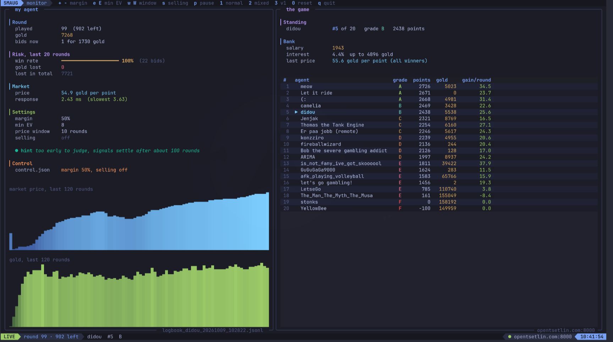

# Smaug: an auction agent for a live class battle

An AI auction bot written in Python for the IKT110 course (Artificial Intelligence
Architecture) at the University of Agder. On 9 October 2026, the agents of the whole class
played two live games of 1000 rounds against each other on the teacher's server. 

## The game

[dnd_auction_game](https://github.com/ooki/dnd_auction_game) is played by a dragon's
auction house. Every second, about 30 chests of points (rolled with dice) go up for
auction. The highest bid wins and pays in full, the others get half of their bid back.
Every player earns a salary in gold, can save at a bank that pays interest up to a limit,
and can sell points back to the bank. Only points count at the end.

## The strategy: a prudent investor

1. **Filter**: skip auctions worth less than 8 points on average.
2. **Save**: keep gold at the bank up to its interest limit.
3. **Buy**: bid the recent market price per point (median of the last 10 rounds) plus a
   30% margin, best auctions first, using only the gold above the savings.
4. **Sell**: when the bank pays at least twice my market price for a point, sell 2% of my
   points and buy them back at auction.
5. **Finish**: spend the savings over the last 100 rounds, before the final rush where
   everyone empties their pockets.

## What I learned

### Simulate before deciding

Every setting of the agent was chosen by measuring, not by guessing. I built a simulator
on top of the teacher's game engine that plays a full 1000-round game in about 10 seconds,
in the exact order of the real server, with the exact code of my agent. A tournament of
about 2,300 games, changing one setting at a time and confirming each choice on games it
had never seen, moved my average place from 8.9 to 3.0 out of 20.

The battle also taught me the limit of a simulation: it is only as good as its opponents.
In my local rehearsals against the teacher's example agents, mine finished 1st twice. My
classmates bid much harder: points cost about 20 gold in the rehearsals and up to 100 gold
in the real games. The agent held up, but the gap between the lab and the real class is
why I expected B to D and not A.

### Code that never crashes

A crashed agent misses rounds, and 10 points or less is an F. The teacher also warned that
the server would sometimes send broken data on purpose. So the agent never trusts the
server: its own receive loop checks every field (type, presence, sane value) and skips a
broken round instead of crashing, and every bid goes through an "airbag" that turns it
into a clean whole number the agent can afford. I fed it 10,000 random or broken messages
in tests, cut the network in the middle of a game, killed the process and restarted it
over TLS: it found its account back every time. It also refuses to reconnect after a game
is over, because that would reset the scoreboard for the whole class.

### Steering a live agent



The agent plays alone, but a separate terminal monitor (built with Textual) shows its
signals next to the scoreboard: win rate, gold lost on lost bids, market price, response
time. Its keys never touch the agent: they only write a small instruction file that the
agent reads every round and bounds before using. If the monitor crashes, the agent keeps
playing.

I used it for real. In the first battle the class was much more aggressive than my
simulations, the agent won only half of its bids, and I raised the margin step by step.
For the second battle I started with a higher margin and switched point selling off: the
agent won 87% of its bids and finished 5th instead of 7th.

### A stressful exercise

A live game moves at one round per second, in front of the class, with no second try.
Every decision on the monitor had to be taken under pressure and without overreacting:
the rule I set myself was to wait about 100 rounds before trusting a signal, and to move
one setting at a time. Preparing that moment calmly beforehand, with presets tested in the
tournament and a checklist for the day, is what made it manageable.

## Built with

Python 3.12 and numpy for the agent, Textual for the monitor, pytest (163 tests),
uv, and GitHub Actions running the tests before every merge into a protected `main`.

## Run it

Setup with [uv](https://docs.astral.sh/uv/):

```bash
make install
```

Or with plain pip (Python 3.12):

```bash
python3.12 -m venv .venv
source .venv/bin/activate
pip install -e . pytest
```

| Command | What it does |
|---|---|
| `make test` | run the tests |
| `make battle` | play for real, with the server settings in `.env` (copy `.env.example`) |
| `make monitor` | live view of the agent and the scoreboard, in a second terminal |
| `make rehearsal` | full local game against the teacher's example agents (`ROUNDS=300 OPPONENTS=5`) |
| `make sim` | one simulated game in seconds, no server (`CLASS=weak\|mixed\|strong`) |
| `make tournament` | many simulated games per class and setting (`GAMES=20 FIRST_SEED=1`) |

Monitor keys: `+` `-` margin, `E` `e` minimum value, `W` `w` price window, `s` selling
on or off, `p` pause, `1` `2` `3` presets, `0` defaults, `q` quit (the agent keeps
playing). The same instructions can be written by hand in `logs/control.json`:

```json
{"margin": 0.5, "min_expected_value": 8, "sell_share": 0, "pause": false}
```

```
src/smaug/agent/   the agent: strategy, safety (airbag), connection, live control
src/smaug/tui/     the monitor
src/smaug/sim/     the simulator and the tournament
tests/             the tests
results/           expected results and rehearsal reports
context/           the teacher's game, read only
```
